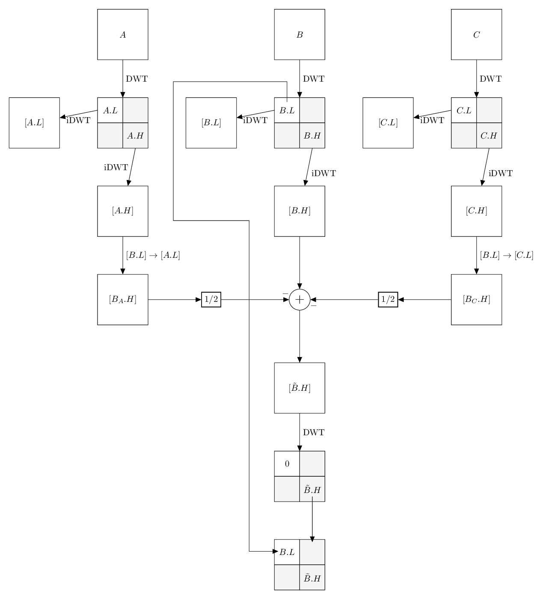
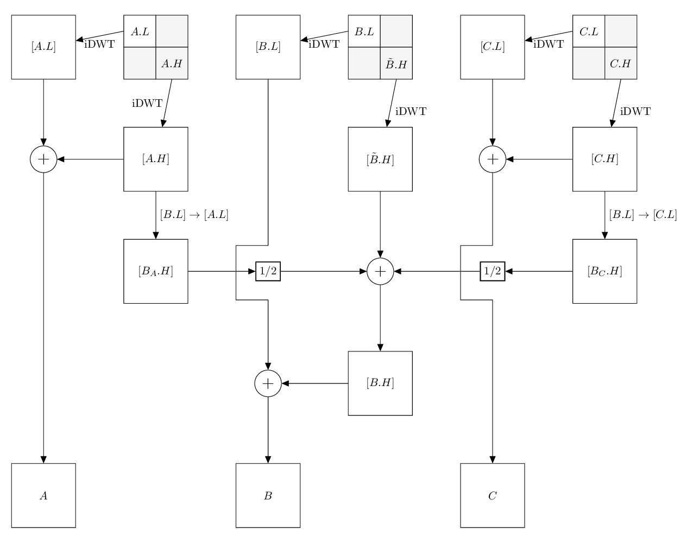

..
  MCDWT module
  ============

..  .. automodule:: MCDWT
..      :members:
..      :undoc-members:
..      :show-inheritance:

Motion Compensated Discrete Wavelet Transform (MCDWT)
=====================================================

MCDWT and video scalabilty
**************************

MCDWT inputs a video_ and outputs a video, in a way that when using
only a portion of the data of the transformed video, a video with a
lower `temporal resolution`_, lower `spatial resolution`_ or/and lower
quality can be generated.

If all the transformed data is used, then the original video is
obtained (MCDWT is a lossless transform). The video output has exactly
the same number of elements than the input video (for example, no
extra motion fields are produced). At this moment, we will focuse only
on spatial scalability.

.. _temporal resolution: https://en.wikipedia.org/wiki/Temporal_resolution
.. _spatial resolution: https://en.wikipedia.org/wiki/Image_resolution#Spatial_resolution
.. _scalability: http://inst.eecs.berkeley.edu/~ee290t/sp04/lectures/videowavelet_UCB1-3.pdf
.. _video: https://en.wikipedia.org/wiki/Video

Video transform choices
***********************

To obtain a multiresolution version or a video, the `DWT`_ (Discrete
Wavelet Transform) can be applied along temporal ($t$) and spatial
domains ($2D$). At this point, two alternatives arise: (1) a $t+2D$
transform or (2) a $2D+t$ transform. In a $t+2D$ transform, the video
is first analyzed over the time domain and next, over the space
domain. A $2D+t$ transform does just the opposite.

.. _DWT: https://en.wikipedia.org/wiki/Discrete_wavelet_transform

Each choice has a number of *pros* and *cons*. For example, in a
$t+2D$ transform we can apply directly any image predictor based on
motion estimation because the input is a normal video. However, if we
implement a $2D+t$ transform, the input to the motion estimator is a
sequence of images in the DWT domain. The overwhelming majority of
DWT's are not `shift invariant`_, which basically means that
$\text{DWT}(s(t)) \neq \text{DWT}(s(t+x))$, where $x$ is a
displacement of the signal $s(t)$ along the time domain. Therefore,
motion estimators which compare pixel values will not work on the DWT
domain. On the other hand, if we want to provide true spatial
scalability (processing only those spatial resolutions (scales)
necessary to get a spatially scaled of our video), a $t+2D$
transformed video is not suitable because the first step of the
forward transform ($t$) should be reversed at full resolution in the
backward transform (as the forward transform did).

.. _shift invariant: http://www.polyvalens.com/blog/wavelets/theory

Wavelet and pyramid domains
***************************

Indeed, DWT generates a scalable representation of an image and by
extension, of a video if we apply the DWT on all the images of the
video.  This can be also done with `Gaussian and Laplacian
pyramids`_. Image pyramids are interesting because they are shift
invariant and therefore, one can operate within the scales as they
were *normal* images. However, as a consecuence of image pyramids
representations are not critically sampled, they need more memory than
DWT ones and this is a drawback when compressing. Luckily, its easy to
convert a Laplacian pyramid representation into a DWT representation,
and viceversa. For this reason, even if we use the DWT to encode our
images, we can suppose at any moment that we are working with the
pyramid of those images.

.. _Gaussian and Laplacian pyramids: https://en.wikipedia.org/wiki/Pyramid_(image_processing)

DWT is used, for example, in `the JPEG2000 image and video compression
standard <https://en.wikipedia.org/wiki/JPEG_2000>`_. Notice that only
the spatial redundancy is exploited. All the temporal redundancy is
still in the video.


Also you can use the ``::`` operator to basically render any text exactly using
fixed width fonts and by passing the restructured text engine.  
This is useful for ascii art::

			           .,,.
			         ,;;*;;;;,
			        .-'``;-');;.
			       /'  .-.  /*;;
			     .'    \d    \;;               .;;;,
			    / o      `    \;    ,__.     ,;*;;;*;,
			    \__, _.__,'   \_.-') __)--.;;;;;*;;;;,
			     `""`;;;\       /-')_) __)  `\' ';;;;;;
			        ;*;;;        -') `)_)  |\ |  ;;;;*;
			        ;;;;|        `---`    O | | ;;*;;;
			        *;*;\|                 O  / ;;;;;*
			       ;;;;;/|    .-------\      / ;*;;;;;
			      ;;;*;/ \    |        '.   (`. ;;;*;;;
			      ;;;;;'. ;   |          )   \ | ;;;;;;
			      ,;*;;;;\/   |.        /   /` | ';;;*;
			       ;;;;;;/    |/       /   /__/   ';;;
			       '*jgs/     |       /    |      ;*;
			            `""""`        `""""`     ;'
				    
Input
*****

A sequence $V$ of $n$ images::
  
                                                          x
 +---------------+  +---------------+     +---------------+
 |               |  |               |     |            |  |
 |               |  |               |   y |----------- O <---- V[n-1][y][x]
 |               |  |               | ... |               |
 |               |  |               |     |               |
 |               |  |               |     |               |
 |               |  |               |     |               |
 +---------------+  +---------------+     +---------------+
       V[0]               V[1]                 V[n-1]


Output
******
A sequence $S$ of $n$ "pyramids". For example, a 2-levels 2D-DWT looks like::
+---+---+-------+  +---+---+-------+     +---+---+-------+
|LL2|HL2|       |  |   |   |       |     |   |   |       |
+---+---+  HL1  |  +---+---+       |     +---+---+       |
|LH2|HH2|       |  |   |   |       |     |   |   |       |
+---+---+-------+  +---+---+-------+ ... +---+---+-------+
|       |       |  |       |       |     |       |       |
|  LH1  |  HH1  |  |       |       |     |       |       |
|       |       |  |       |       |     |       |       |        
+-------+-------+  +-------+-------+     +-------+-------+
       S[0]               S[1]                  S[2]

where `L` and `H` stands for *low-pass filtered* and *high-pass filtered*, respectively. The integer > 1 that follows these letters represents the subband level. For the sake of simplicity, we will denote the subbands `{LH, HL, HH}` as only `H`, and `LL` as only `L`. 

### Algorithm
```pytho
for image in V:
  2D_DWT(image) # In place
S = V # Pointer copy
```

### Scalability
The 2D-DWT applied to a video produces a representation scalable in the space (we can extract different videos with different spatial scales or resolutions), in the time (we can extract diferent videos with different number of frames) and in quality (we can get the DWT coefficients with different quantization steps to reconstruct videos of different quality).

### Inverse 's'-levels inverse 2D-DWT
In the last example, subbands `V2={S[0].LL2, S[1].LL2, ..., S[n-1].LL2}` represent the scale (number) 2 of the original video (the spatial resolution of this `V2` is the resolution of `V` divided by 4 in each spatial dimension).

To reconstruct the scale 1, we apply the 2D_iDWT (1-level 2D inverse DWT) in place (this means that the output of the transform replaces all or a part of the input data):
```python
for pyramid in S:
  2D_iDWT(pyramid) # In place
V = S # Pointer copy
```

And finally, to get the original video, we need to apply again the previous code over `S = V`.

### Implementation of 2D_DWT and 2D_iDWT
See for example, [pywt.wavedec2()] __(https://pywavelets.readthedocs.io/en/latest/ref/2d-dwt-and-idwt.html#d-multilevel-decomposition-using-wavedec2) at [PyWavelets] __(https://pywavelets.readthedocs.io/en/latest/index.html).

### Redundancy and compression
The 2D-DWT provides an interesting feature to `S`: usually, `H` subbands has a lower entropy than `V`. This means that if we apply to `S` an entropy encoder, we can get a shorter representation of the video than if we encode `V` directly. This is a consequence of 2D-DWT exploits the spatial redudancy of the images of the video (neighboring pixels tend to have similar values and when they are substracted, they tend to produce zeros).

## Why MCDWT?
As we have said, the 2D-DWT does not exploit the temporal redundancy of a video. This means that we can achieve higher compression ratios if (in addition to the 2D-DWT) we apply a 1D-DWT along the temporal domain. This is exactly what MCDWT does. However, due to the temporal redundancy is generated mainly by the presence of objects in the scene of the video which are moving with respect to the camera, some sort of motion estimation and compensation should be used.

### MCDWT input
A sequence `V` of `n` images.

### MCDWT output
A sequence `T` of `n` pyramids, organized in `l` temporal subbands, where each subband is a sequence of pyramids. The number of input and output pyramids is the same.

For example, if `l=2` and `n=5`:

```
      Spatial
      scale 0 1 2       t = 1                               t = 3
            ^ ^ ^ +---+---+-------+                   +---+---+-------+                                ^
            | | | |   |   |       |                   |   |   |       |                                |
            | | v +---+---+       |                   +---+---+    O <---- T[3][y][x]                  |
            | |   |   |   |       |                   |   |   |       |                                |
            | v   +---+---+-------+                   +---+---+-------+ l = 0                          |
            |     |       |       |                   |       |       |                                |
            |     |       |       |                   |       |       |                                |
            |     |       |       |                   |       |       |                                |
            v     +-------+-------+       t = 2       +-------+-------+                                |
                      |       |     +---+---+-------+     |        |                                 ^ |
                      |       |     |   |   |       |     |        |                                 | |
                      |       +---->+---+---+       |<----+        |                                 | |
                      |             |   |   |       |              |                                 | |
                      |             +---+---+-------+ l = 1        |                                 | |
                      |             |       |       |              |                                 | |
                      |             |       |       |              |                                 | |
                      |             |       |       |              |                                 | |
      t = 0           |             +-------+-------+              |           t = 4                 | |
+---+---+-------+     |                 |       |                  |     +---+---+-------+         ^ | |
|   |   |       |     |                 |       |                  |     |   |   |       |         | | |
+---+---+       |<----+                 |       |                  +---->+---+---+       |         | | |
|   |   |       |                       |       |                        |   |   |       |         | | |
+---+---+-------+                       |       |                        +---+---+-------+  l = 2  | | |
|       |       |                       |       |                        |       |       |         | | |
|       |       |<----------------------+       +----------------------->|       |       |         | | |
|       |       |                                                        |       |       |         | | |
+-------+-------+                                                        +-------+-------+         v v v
      GOP 0                                       GOP 1                             Temporal scale 2 1 0
<---------------><----------------------------------------------------------------------->

(X --> Y) = X depends on Y (X has been encoded using Y)
```

### Forward (direct) MCDWT step



### Backward (inverse) MCDWT step



### Forward MCDWT
```
n = 5 # Number of frames of the video
l = 2 # Number of temporal scales to generate

x = 2 # A constant
for j in range(l):
    2D_DWT(V[0]) # 1-level 2D-DWT
    [A.L] = 2D_iDWT(V[0].L, 0)
    [A.H] = 2D_iDWT(0, V[0].H)
    i = 0 # Image index
    while i < (n//x):
        2D_DWT(V[x*i+x//2])
        [B.L] = 2D_iDWT(V[x*i+x//2].L, 0)
        [B.H] = 2D_iDWT(0, V[x*i+x//2].L)
        2D_DWT(V[x*i+x])
        [C.L] = 2D_iDWT(V[x*i+x].L, 0)
        [C.H] = 2D_iDWT(0, V[x*i+x].L)
        [B.L]->[A.L] = ME([B.L], [A.L])
        [B.L]->[C.L] = ME([B.L], [C.L])
        [B.H]_A = MC([A.H], [B.L]->[A.L])
        [B.H]_C = MC([C.H], [B.L]->[C.L])
        [~B.H] = [B.H] - int(round(([B.H]_A + [B.H]_C)/2.0))
        2D_DWT([~B.H])
        [~B.H].L = B.L
        [A.L] = [C.L]
        [A.H] = [C.H]
        i += 1
    x *= 2
```

Example (3 temporal scales (`l=2` iterations of the transform) and `n=5` images):
```
V[0] V[1] V[2] V[3] V[4]
 A    B    C              <- First call of MCDWT_step
           A    B    C    <- Second call of MCDWT_step
 A         B         C    <- Third call of MCDWT_step
---- -------------------
GOP0        GOP1
```

### Backward MCDWT
```
n = 5 # Number of images
l = 2 # Number of temporal scales

x = 2**l
for j in range(l):
    [A.L] = 2D_iDWT(V[0].L, 0)
    [A.H] = 2D_iDWT(0, V[0].H)
    V[0] = [A.L] + [A.H]
    i = 0 # Image index
    while i < (n//x):
        [B.L] = 2D_iDWT(V[x*i+x//2].L, 0)
        [~B.H] = 2D_iDWT(0, V[x*i+x//2].H)
        [C.L] = 2D_iDWT(V[x*i+x].L, 0)
        [C.H] = 2D_iDWT(0, V[x*i+x].H)
        V[x*i+x] = [C.L] + [C.H]
        [B.L]->[A.L] = ME([B.L], [A.L])
        [B.L]->[C.L] = ME([B.L], [C.L])
        [B.H]_A = MC([A.H], [B.L]->[A.L])
        [B.H]_C = MC([C.H], [B.L]->[C.L])
        [B.H] = [~B.H] + int(round(([B.H]_A + [B.H]_C)/2.0))
        V[x*i+x//2] = [B.L] + [B.H]
        [A.L] = [C.L]
        [A.H] = [C.H]
        i += 1
    x //= 2
```

### Data extraction examples

#### Spatial scalability

Scale 2:

Provided by subbands L of the pyramids.

Scale 1:

Provided after running iMCDWT one iteration. For 3 pyramids A={A.L,A.H}, B={B.L,~B.H} and C={C.L,C.H} where the subband L is the scale 2, the scale 1 is recostructed by (see Algoithm iMCDWT_step):

[A.L] = iDWT(A.L,0);
[A.H] = iDWT(0,A.H);
V[0] = [A.L] + [A.H];
[B.L] = 2D_iDWT(V[1].L,0);
[~B.H] = 2D_iDWT(0,V[1].H);
[C.L] = 2D_iDWT(V[2].L,0);
[C.H] = 2D_iDWT(0,V[2].H);
V[2] = [C.L] + [C.H] 
[B.L]->[A.L] = ME([B.L], [A.L])
[B.L]->[C.L] = ME([B.L], [C.L])
[B.H]_A = MC([A.H], [B.L]->[A.L])
[B.H]_C = MC([C.H], [B.L]->[C.L])
[B.H] = [~B.H] + int(round(([B.H]_A + [B.H]_C)/2.0))
V[1] = [B.L] + [B.H]
[A.L] = [C.L]
[A.H] = [C.H]
...

Scale 2:

Repeat the previous computations.

Scale -1:

Repeat the previous computations, placing 0's in the H subbands.
